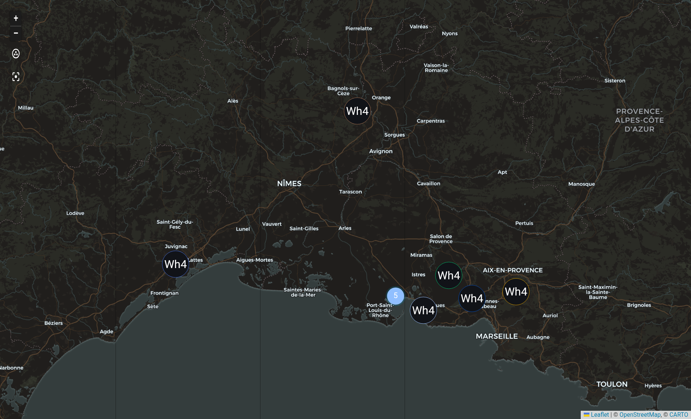

# NASA FIRMS Wildfire Monitor for Home Assistant

[](https://ko-fi.com/mrbenedict)

Near-real-time satellite wildfire detection from [NASA FIRMS](https://firms.modaps.eosdis.nasa.gov/)
(VIIRS + MODIS) as native Home Assistant entities: fires on the map card,
aggregate sensors, and everything you need for proximity alerts.

This grew out of a [zero-custom-code setup using `geo_json_events`](https://community.home-assistant.io/t/wildfire-monitoring-with-nasa-firms-live-fire-map-proximity-alerts-zero-custom-components/1016485)
and fixes what that approach structurally can't:

| | `geo_json_events` | this integration |
|---|---|---|
| FIRMS attributes (confidence, FRP, brightness, time, satellite) | dropped | preserved per fire |
| Multiple satellites | duplicate markers | deduplicated into one fire per ~1 km cluster |
| Filtering (min confidence / min FRP) | impossible | config option |
| Area definition | hand-computed BBOX (`cos(radians(lat))` footgun) | pick location + radius on a map |
| MAP_KEY | visible in the entry title | stored in config data, never displayed |
| Polling | every 5 min | every 15 min, matching NASA's refresh cadence |
| Count / nearest-distance sensors | template DIY | built in, plus max FRP |
| Wind at the fire | not available | fetched for the nearest fire's own coordinates |



*Live screenshot (dark theme, standard map card): deduplicated VIIRS detections
during the July 2026 fires in southern France — each marker is one logical fire,
merged from up to three satellites.*

## Installation

**HACS** (recommended): HACS → Integrations → ⋮ → *Custom repositories* →
add `https://github.com/bangboomben/ha-nasa-firms` as *Integration* → install → restart.

**Manual**: copy `custom_components/nasa_firms` into your `config/custom_components/` and restart.

## Setup

1. Get a free MAP_KEY at <https://firms.modaps.eosdis.nasa.gov/api/map_key/>
   (rate limit 5 000 requests / 10 min — this integration uses a handful per 15 minutes).
2. Settings → Devices & Services → Add Integration → **NASA FIRMS Wildfire Monitor**.
3. Enter the key, pick your FIRMS region, drag the location pin onto the spot
   you want to watch, set the radius, choose satellites and filters.

Satellites, detection window (24 h / 7 days), minimum confidence and minimum
fire radiative power can be changed later via the entry's *Configure* dialog.

## Entities

Per config entry:

| Entity | Meaning |
|---|---|
| `sensor.<name>_hotspots` | Number of deduplicated fires in the radius (attributes: raw detections, per-satellite counts, fetch errors) |
| `sensor.<name>_nearest_hotspot` | Distance to the closest fire in km (`unknown` when there is none). Attributes: `nearest_entity_id`, `bearing`, `direction`, `wind_bearing`, `wind_direction`, `wind_speed` |
| `sensor.<name>_max_fire_radiative_power` | Strongest fire in MW |
| `geo_location.*` (source `nasa_firms`) | One entity per fire, with `frp_mw`, `confidence`, `satellites`, `detections`, `brightness_k`, `acquired`, `daynight` |

### Pointing at the nearest fire

The nearest-hotspot sensor carries the id of the fire entity it is reporting, so
you can read any of that fire's attributes without searching for it yourself:

```jinja

{{ state_attr(e, 'frp_mw') }} MW, {{ state_attr(e, 'confidence') }} confidence,
seen by {{ state_attr(e, 'satellites') | join(' + ') }}
```

`bearing` (degrees) and `direction` (16-point compass) are on the same sensor —
great-circle values, so they stay correct at high latitudes:

```jinja
Fire {{ states('sensor.firms_40_54_23_01_nearest_hotspot') }} km
{{ state_attr('sensor.firms_40_54_23_01_nearest_hotspot', 'direction') }}
```

### Wind at the fire

The same sensor carries the wind **at the nearest fire's own coordinates**, not
at your house — which is the whole point, since the two can differ completely
across a valley:

| Attribute | Meaning |
|---|---|
| `wind_bearing` | Direction the wind is blowing **from**, in degrees (0 = from the north) |
| `wind_direction` | The same, as a 16-point compass abbreviation (`SW`, `NNE`, …) |
| `wind_speed` | Wind speed in **m/s** at 10 m above ground (multiply by 3.6 for km/h) |

`wind_direction` is the one to put on a dashboard; `wind_bearing` is the one to
calculate with, exactly like `direction` and `bearing` for the fire itself.

Source: [met.no Locationforecast](https://api.met.no/weatherapi/locationforecast/2.0/documentation).
One request per 15-minute cycle, for the nearest fire only, cached according to
met.no's own `Expires` header. All three attributes are `None` when there is no
fire in range or the lookup did not succeed — the fire data is unaffected
either way.

#### Upwind or downwind: work it out yourself

`bearing` is measured **from you to the fire**, `wind_bearing` is the direction
the wind comes **from** at the fire. The wind pushes smoke towards
`wind_bearing + 180°`, and the line from the fire to you is `bearing + 180°` —
the same 180° on both sides, so the smoke travels along your line of sight
exactly when the two raw numbers are close:

```jinja




  {# 0 deg = wind pushing along the fire-to-you line, 180 deg = the other way #}
  {% set delta = (((wind - fire) + 180) % 360 - 180) | abs | round %}
  Fire {{ states(s) }} km {{ state_attr(s, 'direction') }},
  wind from {{ state_attr(s, 'wind_direction') }} at
  {{ (state_attr(s, 'wind_speed') * 3.6) | round(1) }} km/h,
  {{ delta }}° off the line towards you.

```

**Read that number for what it is.** It is a geometry calculation on two
observations, not a safety assessment:

- `wind_speed` and `wind_bearing` are a **forecast** for the fire's grid cell,
  not a measurement at the flame front, and they come from the forecast step
  nearest the current time — hourly resolution, roughly 1 km of ground.
- **Wind turns.** A comfortable 170° now says nothing about the next hour, and a
  wind shift is the classic way a fire surprises people.
- **In light wind the direction barely means anything.** Below roughly 3 m/s,
  forecast models disagree wildly: on a spot checked while writing this, two
  independent models agreed on the speed to within 0.2 m/s and were 65° apart
  on the direction. Weight the direction by the speed next to it.
- **Terrain beats wind direction.** Fires run uphill far faster than downhill,
  large fires generate their own wind, and slope, fuel and humidity matter as
  much as the direction the smoke is drifting today.
- The wind **at the fire** is not the wind along the whole path to you, and this
  says nothing about plume height or how far smoke will actually carry.

So: a useful extra input, never an all-clear. Your country's official warning
channel stays the authority on whether to act.

#### What leaves your instance

When there is a fire in range, its coordinates — rounded to about 1 km — are
sent to met.no once per update cycle to look up the wind. Nothing about your own
location, your MAP_KEY or your instance is included.

## Dashboard

The fires show up on the standard map card — no custom cards, nothing to
configure beyond naming the source:

```yaml
type: map
geo_location_sources:
  - nasa_firms
entities:
  - zone.home
default_zoom: 8
theme_mode: auto
```

Each fire is drawn as a flame marker. The map card cannot use an entity's icon
for markers it pulls in through `geo_location_sources` — it would otherwise
label them with the first letters of the entity name — so the integration ships
the flame as the entity picture instead. Nothing to configure, and it looks the
same in light and dark themes.

**One card shows every configured location.** `nasa_firms` is a single source
name shared by all config entries, so a card set up this way plots the fires of
all of them together. If you monitor two places far apart, either accept the
zoomed-out view or give each one its own card listing its fire entities
explicitly (`auto-entities` and similar cards can filter them by name).

Only fires inside the radius you configured ever become entities, so the map
never shows detections from beyond it.

### The map plus everything the integration knows

A map answers *where*. This pairs it with the rest — how far, how strong, seen
by which satellites, and the wind at the fire — using only built-in cards. It
deliberately spells out what each number means instead of printing bare values:
`nominal` and `1.19 MW` tell you nothing until someone says what they are.
Replace the two entity ids on the first two lines with yours and paste it in:

```yaml
type: vertical-stack
cards:
  - type: map
    geo_location_sources:
      - nasa_firms
    entities:
      - zone.home
    default_zoom: 8
    theme_mode: auto
    aspect_ratio: "1:1"
  - type: markdown
    content: |
      
      
      
      
      ### No active fires
      Nothing detected in the area you are monitoring.
      
      ### Nearest fire: {{ km }} km away
      It lies to the **{{ state_attr(s, 'direction') }}** of you. {{ states(n) }} fires detected in the monitored area in the last 24 hours.
      
      

      **How strong** — {{ state_attr(e, 'frp_mw') }} MW of radiated heat, i.e. how fiercely it was burning as the satellite passed over.
      **How certain** — {{ state_attr(e, 'confidence') }}. That is the satellite's own confidence that this is a real fire rather than a false alarm; it runs low, nominal, high.
      **When** — {{ state_attr(e, 'acquired') }}, seen by {{ state_attr(e, 'satellites') | join(' and ') }}.
      
      
      
      
      
      **Wind** — no reading for the fire's location at the moment.
      
      {%- set off = (((wind - fire) + 180) % 360 - 180) | abs %}
      **Wind at the fire** — from the {{ state_attr(s, 'wind_direction') }} at {{ (speed * 3.6) | round }} km/h, pushing the smoke **towards you****sideways to your position****away from you**.
      
      At this wind speed the direction says little — forecast models disagree by tens of degrees in light wind.
      
      Wind shifts, and slope and fuel matter as much: this is the air at the fire right now, not a prediction of where the smoke ends up.
      
      
```

It renders roughly like this:

> ### Nearest fire: 9.2 km away
> It lies to the **SW** of you. 12 fires detected in the monitored area in the last 24 hours.
>
> **How strong** — 1.19 MW of radiated heat, i.e. how fiercely it was burning as the satellite passed over.
> **How certain** — nominal. That is the satellite's own confidence that this is a real fire rather than a false alarm; it runs low, nominal, high.
> **When** — 2026-07-26 01:32 UTC, seen by noaa21 and snpp.
>
> **Wind at the fire** — from the NW at 24 km/h, pushing the smoke **sideways to your position**.
> Wind shifts, and slope and fuel matter as much: this is the air at the fire right now, not a prediction of where the smoke ends up.

Every branch is covered: no fires in range collapses it to two lines, a failed
weather lookup only replaces the wind sentence, and below roughly 3 m/s the card
adds a line warning that the wind direction is then close to meaningless.

The wind sentence puts the geometry into words — the same calculation as the
[recipe above](#upwind-or-downwind-work-it-out-yourself), stated as *towards*,
*sideways to* or *away from* you instead of an angle. **Read it as the
observation it is, with the caveats from that section in mind.** "Away from you"
describes where the air is moving at this moment; it is not an all-clear, and
the card says so on the next line. If you would rather show the raw angle and
draw no picture at all, swap that one line for the version in the recipe.

Using [Bubble Card](https://github.com/Clooos/Bubble-Card)? The same two cards
drop straight into a `pop-up` as its `cards:` list, so a tile on your dashboard
opens the full picture.

## Proximity alert example

```yaml
alias: "Wildfire proximity warning"
triggers:
  - trigger: numeric_state
    entity_id: sensor.firms_40_54_23_01_nearest_hotspot
    below: 15
actions:
  - action: notify.mobile_app_your_phone
    data:
      title: "🔥 Wildfire warning"
      message: >-
        Fire {{ trigger.to_state.state }} km away
        (NASA FIRMS satellite detection).
mode: single
```

## Honest limitations

- **Not a real-time alarm.** VIIRS satellites pass ~2× per day each (three
  satellites shrink the gap to a few hours), plus up to ~3 h processing
  latency. This reliably answers *"where is it burning and how far from me"* —
  a freshly ignited fire can be invisible for hours. Pair it with your
  country's official warning channel (in Europe: the `meteoalarm` integration).
- FIRMS detects **thermal anomalies**, not wildfires. Factories, flares and
  landfills show up too — that's what the confidence/FRP filters are for.
  Automatic suppression of persistent heat sources is on the roadmap.
- A hotspot is the center of a 375 m satellite pixel; expect a few hundred
  meters of positional tolerance.

## Roadmap

- Auto-ignore persistent heat sources (same spot detected across many days)
- Protocol layer (`api.py`, intentionally free of HA imports) extracted to a
  PyPI package, then a Home Assistant Core submission alongside the existing
  geo-feed family (`nsw_rural_fire_service_feed`, `qld_bushfire_feed`, …)

## Support

This integration is free and always will be. If it earns a place on your
dashboard, you can [buy me a coffee](https://ko-fi.com/mrbenedict) ☕ — much
appreciated, never required.

**If you want to help those affected by wildfires:** the best place for your
money is not my coffee fund — it's the people fighting and recovering from
these fires. Consider the [IFRC](https://www.ifrc.org/) or your country's
Red Cross / civil protection. This project stays free either way.

## Credits & disclaimer

This integration was developed with the supporting help of AI tooling
(Claude Code). All changes are reviewed, tested against a live Home Assistant
instance, and maintained by a human.

Fire data courtesy of NASA FIRMS. This project is not affiliated with or
endorsed by NASA. We acknowledge the use of data and imagery from NASA's Fire
Information for Resource Management System (FIRMS), part of NASA's Earth
Science Data and Information System (ESDIS).

Wind data from [MET Norway](https://api.met.no/) (Norwegian Meteorological
Institute), used under [CC BY 4.0](https://creativecommons.org/licenses/by/4.0/)
and reduced to the three values documented above. This project is not affiliated
with or endorsed by MET Norway.

License: [MIT](LICENSE)
